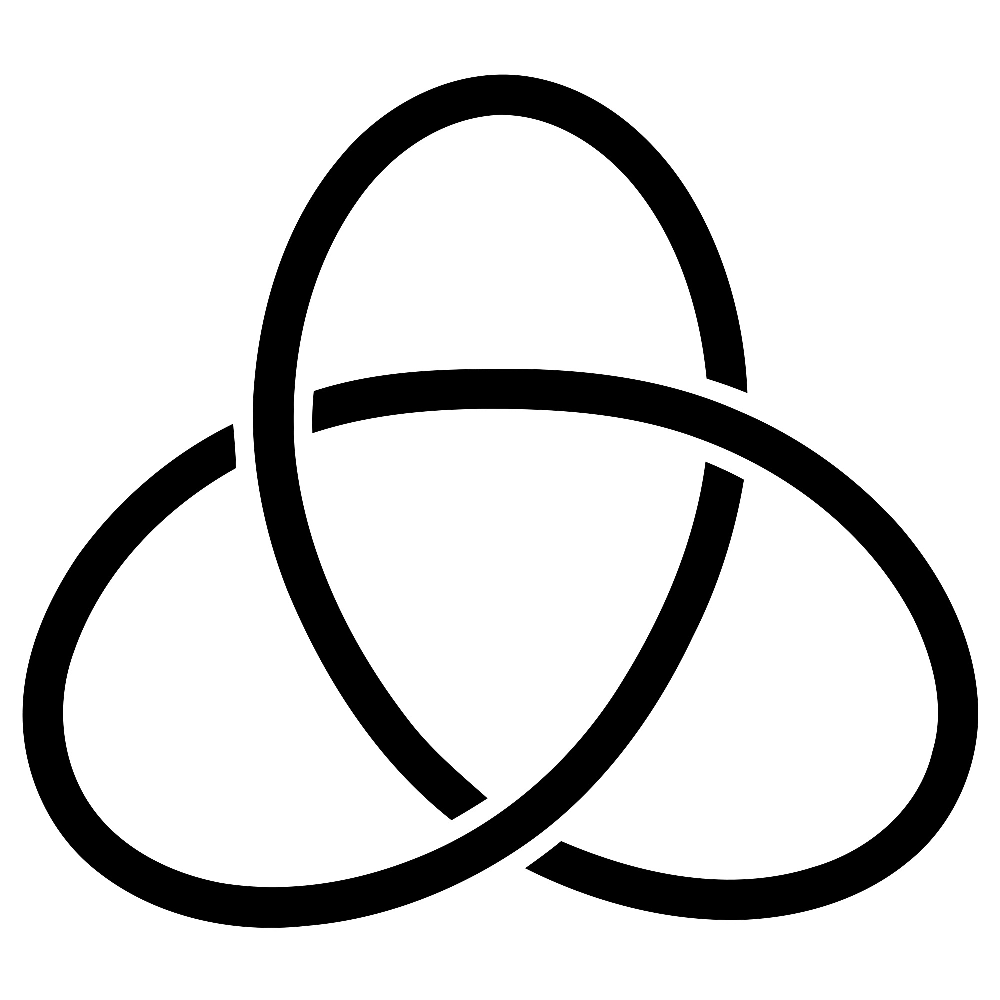

# Knot-Theory

A collection of Knot Theory scripts and programs created as a part of Hamilton College Mathematics 512 as directed by Jose Ceniceros.

## Installation Guide

### Installing Python

Go to the [Python downloads page](https://www.python.org/downloads/) and install Python. You can check if your installation has installed propperly by typing `python3 --version` in your terminal of choice (Windows users may try `python --version` in PowerShell).

### Cloning the GitHub Repo

On UNIX like machines (OSX/Linux), simply type `git clone https://github.com/Ilphu/Knot-Theory` into your terminal or use the [GitHub Desktop](https://desktop.github.com/download/) to clone the code. Doing this will create a folder at you current directory called `Knot-Theory` with all code you see above.

## Use Guide

### Terminal Guide

From your terminal of choice, navigate to the `Knot-Theory` directory. The `cd folder_name` (change directory) command to move from folder to folder, `cd ..` to move up one folder, and `ls`(list) command to list all non-hidden files in the current directory.

Once in the `Knot-Theory` directory type `python3 file.py` or `python file.py` on OSX and Windows respectfully, where `file.py` is the desired file you wish to run.

### IDE Guide

If you are using Thonny, PyCharm, VSCode, or any other integrated development environment/editor, then open the cloned GitHub project in you editor and use built in Python runners while the correct file is open.

### Knots Encoding

A given knot oriented diagram is stored as a list of quadruples where each quadruple encodes one crossing. Each quadruple is of the form (sign, over arc, under arc 1, under arc 2) where under arc 1 is the arc that you first encounter when moving counter clockwise starting from the tail of the over arc (use orientation to determine tail).
